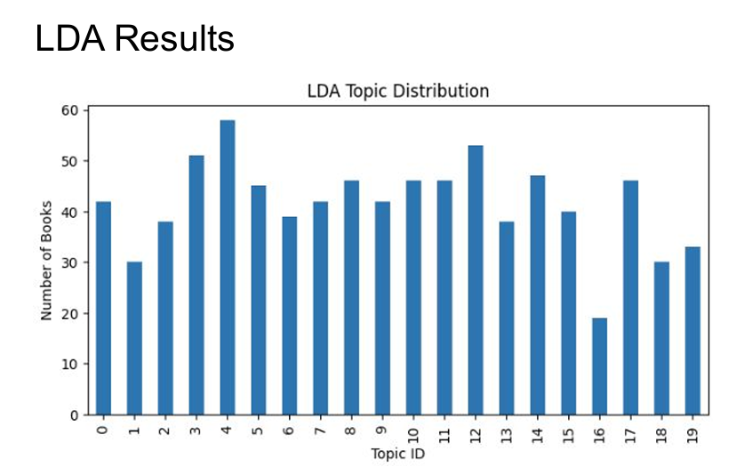

# CariConnect Author–Producer Matching System
### Break Through Tech AI Studio Project (2025)  
**In collaboration with CariCon**

UCSC • UCSD • UCR • CSULB • SJSU

---

## ⭐ Project Highlights
- Built an end-to-end machine learning pipeline to match Caribbean authors with publishers, literary agents, and producers  
- Integrated **800+ historical book-to-production adaptation records** across multiple datasets  
- Achieved strong supervised performance with **~96% accuracy** and **ROC-AUC ≈ 0.99**  
- Applied unsupervised topic modeling to uncover interpretable narrative and genre clusters  
- Designed a scalable and extensible recommendation framework aligned with real-world creative industry needs  

---

## 📌 Project Overview

CariConnect is an AI-powered recommendation system designed to improve visibility and representation for Caribbean authors by matching them with relevant publishers, literary agents, and producers.

Caribbean creatives often face barriers to exposure and access within traditional publishing and production pipelines. CariConnect addresses this challenge by leveraging machine learning to analyze historical adaptation patterns, genre alignment, narrative themes, and creative metadata to predict author–producer compatibility.

This project was developed as part of the **Break Through Tech AI Studio** program in collaboration with **CariCon**, an organization dedicated to expanding Caribbean literature, culture, and storytelling on a global scale.

---

## 🎯 Project Goals
- Build an end-to-end ML system for author–producer matching  
- Clean, merge, and standardize multi-source datasets  
- Engineer features from both textual and categorical data  
- Train supervised and unsupervised models to assess match likelihood  
- Evaluate model performance using Accuracy, ROC-AUC, Precision, Recall, and F1  
- Provide interpretable clustering to help authors identify creative “neighborhoods”  

---

## 📚 Data Exploration

### Datasets Used
- **Book-to-Production Adaptation Records**  
  - 831+ entries documenting historical adaptations  
- **Author Metadata**  
  - Genre labels, descriptions, and writing attributes  
- **Literary Agent Dataset**  
  - Agent roles, affiliations, and representation data  

### Data Preprocessing & Assumptions
- Removed duplicate records and standardized genre labels  
- Cleaned missing or inconsistent metadata fields  
- Normalized textual inputs for downstream modeling  
- Assumed historical adaptation trends provide signal for future compatibility  

---

## 📊 Exploratory Data Analysis & Topic Modeling

### KMeans Clustering Results

We observed a highly imbalanced cluster distribution, with Cluster 15 containing over 200 books.  
This suggests that KMeans may group a dominant theme too aggressively.

### LDA Topic Modeling Results

LDA produced a more balanced topic distribution, indicating better separation of narrative themes.

## 📈 Model Evaluation Results

Our supervised model achieved strong performance with high accuracy and ROC-AUC, demonstrating effective author–producer compatibility prediction.

**Key Insights**
- Certain genres (e.g., drama, folklore, historical fiction) appear disproportionately adapted  
- Topic modeling reveals coherent narrative clusters aligned with adaptation likelihood  
- These insights informed both feature selection and model design  

---

## 🧠 Model Development

### Methods & Justification
- **Supervised Learning**  
  - Random Forest classifier selected for robustness to mixed feature types and interpretability  
- **Unsupervised Learning**  
  - TF-IDF + KMeans, LDA, and BERTopic explored to uncover latent thematic structures  

Unsupervised topic modeling provided interpretable creative clusters that helped explain historical adaptation trends and guided downstream supervised feature engineering.

### Technical Architecture
1. Data ingestion and preprocessing  
2. Feature engineering (textual + categorical)  
3. Unsupervised topic modeling and clustering  
4. Supervised classification and evaluation  
5. Result interpretation and documentation  

---

## 📈 Results & Key Findings

### Supervised Model Performance
- **Accuracy:** ~96%  
- **ROC-AUC:** ≈ 0.99  

### Unsupervised Outcomes
- Coherent topic clusters aligned with genre and narrative themes  
- Improved interpretability of author–producer relationships  
- Provided qualitative insights beyond numeric prediction scores  

---

## 🧩 Code Highlights

| File | Description |
|------|-------------|
| `clean_data.py` | Data cleaning, normalization, and preprocessing |
| `train_model.py` | Model training and evaluation pipeline |
| `EDA.ipynb` | Exploratory data analysis and visualization |
| `modeling.ipynb` | Supervised and unsupervised modeling experiments |

---

## 👥 Team Members — AI Studio 2025

| Name | University | GitHub | Primary Contribution |
|------|------------|--------|----------------------|
| **Mario Zhou** | UC Santa Cruz | https://github.com/QHongboQ | Unsupervised Learning (Topic Modeling & Clustering) |
| **Xiaomai Wang** | UC San Diego | N/A | Supervised Modeling & Evaluation |
| **Sabine Loaiza Chable** | UC San Diego | N/A | Project Introduction & Data Cleaning |
| **Justin Pongos** | CSU Long Beach | N/A | Bias & Fairness Analysis, EDA |
| **Naina Talasu** | San José State University | N/A | Literary Agent Dataset Analysis |
| **Lizbeth Krystal Ramirez** | UC Riverside | N/A | Exploratory Data Analysis |

---

## 👤 Contributor — Mario Zhou

**Mario Zhou**  
AI Studio Fellow — Break Through Tech AI 2025  
University of California, Santa Cruz  

**Final Project Responsibility**
- Led the unsupervised learning pipeline using **TF-IDF + KMeans**, **LDA**, and **BERTopic**  
- Evaluated topic coherence and cluster interpretability  
- Analyzed narrative patterns in historical adaptations  
- Synthesized unsupervised insights to inform supervised feature design  
- Contributed to final technical documentation and interpretation  

---

## ⚙️ Setup & Installation

This project was developed as part of the Break Through Tech AI Studio program using partner-provided datasets.  
Due to data access restrictions, the repository is not intended to be run as a standalone open-source package.  
All analysis and modeling were conducted in controlled development environments.

---

## 🔮 Next Steps
- Integrate transformer-based embeddings (BERT / RoBERTa)  
- Improve hyperparameter optimization and validation strategies  
- Develop an interactive matching tool or API  
- Expand datasets with additional metadata  
- Visualize author–producer networks as similarity graphs  

---

## 🙏 Acknowledgements

We would like to express our sincere gratitude to our AI Studio Coach and Challenge Advisors for their guidance and support throughout this project.

We especially thank **Audra Zook** for her continuous mentorship, structured feedback, and encouragement throughout the AI Studio program. Her guidance was instrumental in helping our team refine our technical approach and align our work with real-world expectations.

We also thank **Solomon Perkins** and **Steve Russell** from **CariCon** for providing the project vision, domain expertise, and industry context that grounded this work in a meaningful real-world problem. Their insights into the Caribbean literary and creative ecosystem were invaluable in shaping both the problem formulation and evaluation of our solution.

---

## 🧑‍🏫 AI Studio Coach & Challenge Advisors

| Name | Role | Contact |
|------|------|---------|
| **Audra Zook** | AI Studio Coach | zook.audra@gmail.com |
| **Solomon Perkins** | Challenge Advisor | falexson@gmail.com] |
| **Steve Russell** | Challenge Advisor | srussell@cari-con.org |

---

## 📄 License
This project was developed for educational and research purposes as part of the Break Through Tech AI Studio program and is not released as open-source software.
